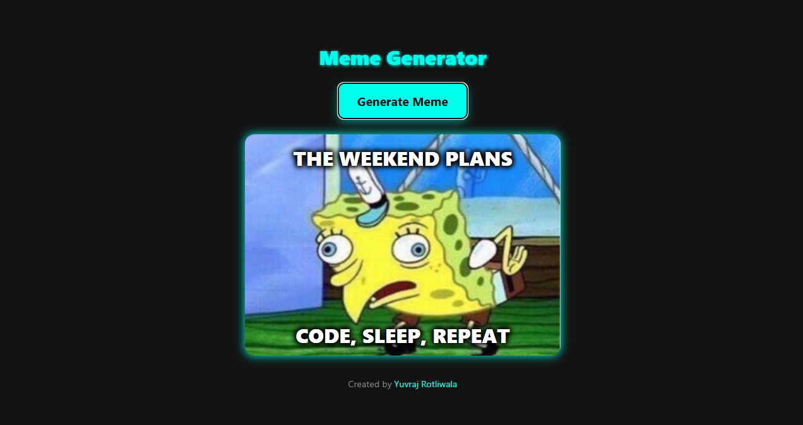

# 🎭 Meme Generator Website

Welcome to the Meme Generator – a fun and interactive web app that lets you create custom memes using popular templates from the MemeGen API.

## 🔥 Features

- 🎨 Click a button to randomly generate memes 
- ✍️ Predefined funny top and bottom texts
- 🔄 Generates a new meme every time the button is clicked
- ⚡ Uses MemeGen API for dynamic meme rendering
- 🖥️ Responsive and user-friendly UI with HTML, CSS, and JavaScript
- 🌐 Hosted on GitHub Pages

## 🚀 Live Demo

🔗 [Click here to try it out](https://yuvraj-1508.github.io/Meme-Generator/)

## 📸 Preview

  
*(Add a screenshot of your site and name it `Demo.png` in the repo)*

## 🛠️ Tech Stack

- **Frontend:** HTML, CSS, JavaScript
- **Styling:** Bootstrap 5
- **API:** [MemeGen API](https://api.memegen.link/templates)
- **Deployment:** GitHub Pages

## 🧩 How It Works

1. On page load, the app fetches meme templates from the MemeGen API.
2. When the user clicks the "Generate Meme" button:
   - A random template is selected
   - A random top and bottom text is picked
   - A meme is rendered using the MemeGen API
3. The generated meme is displayed instantly on the screen.
4. Users can click the button again to generate a new meme.

